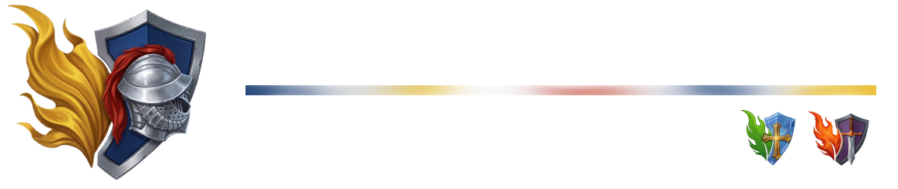
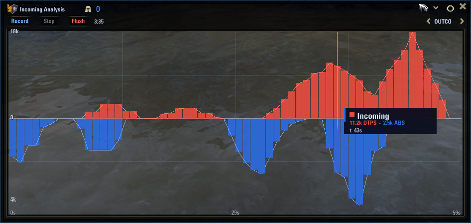
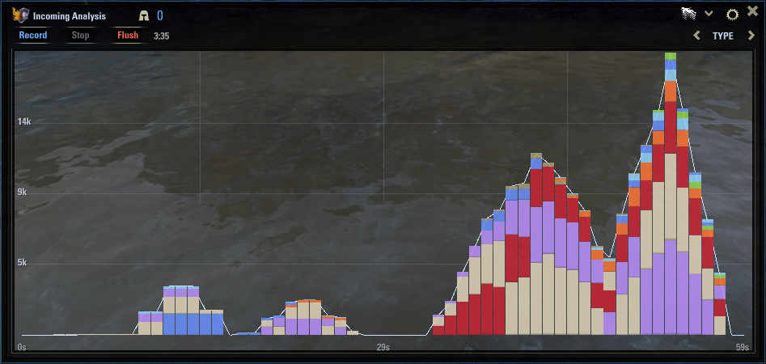
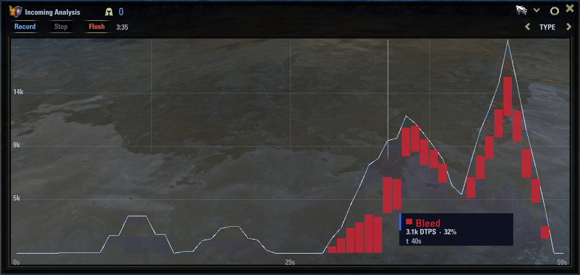
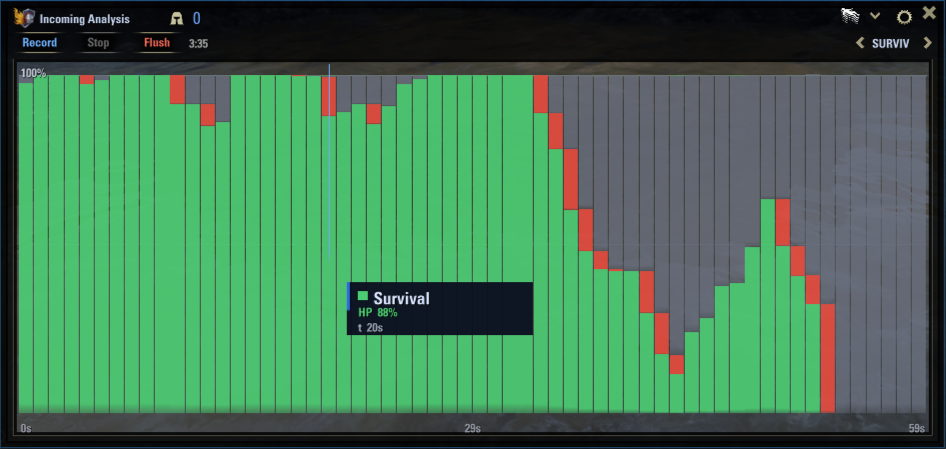
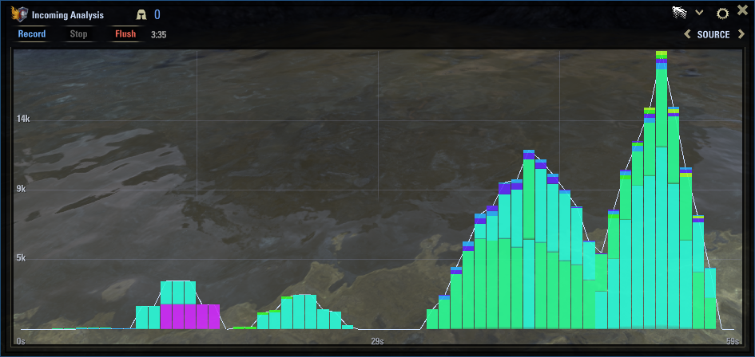
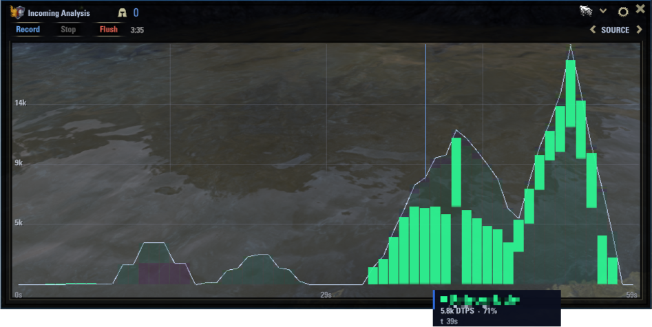
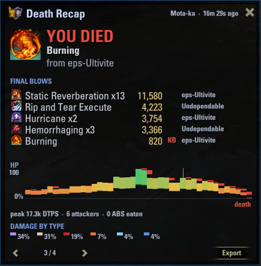
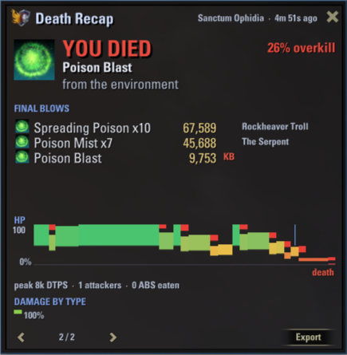

# Verditer

**Incoming-damage & survivability analytics for The Elder Scrolls Online.**
*What hit you. What almost killed you.*

Verditer records the damage **coming at you** and turns it into a clean, scrubbable
timeline — so you can see the spike that dropped you, when your shield broke, and who
was hammering you. Useful for **every role**: tanks reading sustained pressure, healers
checking their own survivability, DPS understanding a death.

It is the third sibling of **Verdant** (healing) and **Vermilion** (outgoing damage):
same engine, the filter flipped to *you* as the target.

---

## Features

- **Four live views** of incoming damage, each answering a different question.
- **Death Recap** — a verdict-first forensic report of how you died.
- **Effective mitigation %** — how much of the incoming your shields actually ate.
- **CSV export** of any recorded session.
- **Standalone** — zero dependencies.
- **Built for performance** — yeah.

---

## The four views

Record with **Record**, freeze with **Stop**, discard with **Flush**. Cycle views with the
arrows in the title bar.

### Outcome
Damage that reached your **HP** grows up in **red** (DTPS); damage your **shield** ate grows
down in **blue** (ABS), from a shared baseline.

### By Damage Type
Incoming damage stacked by type (fire, shock, poison, …) — what *kind* of damage

### Survival
Your HP over time: **green** = remaining, **red** = lost this moment, **grey** = standing wound.
The death-and-respawn reads at a glance.

### By Source
Incoming damage stacked by **attacker** — *who* is killing you. Invaluable in PvP and group PvE.

---

## Death Recap

On death it freezes a verdict report:

- **The verdict** — the killing blow, the attacker, and the overkill %.
- **Final blows** — the server's killing attacks, the killing blow flagged.
- **The lead-up film** — your last ~10 seconds of HP as a green→amber→red silhouette, with a
  **celeste line** where your **shield broke** and an **amber line** at the **peak incoming DTPS**.
- **Pressure** — peak DTPS · # attackers · ABS eaten · **% mitigated**.
- Page through every death of the session, or open them anytime from the **Deaths** button.

---

## Reading the numbers

| Term | Meaning |
|------|---------|
| **DTPS** | Damage Taken Per Second — damage that reached your **HP** (rolling 5 s window). |
| **ABS**  | Absorbed Per Second — damage your **shield** ate. |
| **ITP**  | Incoming Total Pressure — `DTPS + ABS`, the header readout. |
| **Mitigation %** | `ABS / (ABS + DTPS)` — how much of the incoming your shields absorbed. |

## Settings

- **Sampling Rate** (how much detail, up to 5 Hz)
- **Time Window** (how far back the chart remembers)
- **Viewport Alpha** (background tint).
- **Death Recap: On/Off** — disable it entirely if you don't want it (zero cost when off)
- Logo visibility toggle

---

## Installation

1. Download the latest release and unzip into
   `Documents/Elder Scrolls Online/live/AddOns/`.
3. Enable it on the character-select Add-Ons screen.

No dependencies required.

___

## Commands

| Command | Does |
|---|---|
| `/verditer` | Toggle the analytics window |
| `/verditer recap` | Open the Death Recap browser |
| `/verditer export` | Export the recorded session to CSV |
| `/verditer help` | List commands |

You can also bind a key under **Settings → Controls → Keybindings (Add-Ons)**.

---

## Know the family

| Addon | Tracks |
|---|---|
| **[Verdant](https://github.com/vergelli/verdant/tree/main)** | Healing & shielding output |
| **[Vermilion](https://github.com/vergelli/Vermilion/tree/main)** | Outgoing damage |
| **Verditer** | Incoming damage & survivability *(this one)* |

---
